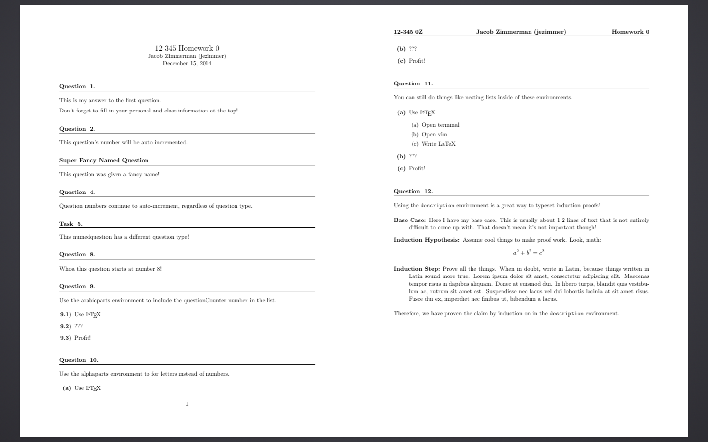

# LaTeX Homework Template

[http://blog.zimmerman.io/2014/10/04/a-latex-homework-template/](http://blog.zimmerman.io/2014/10/04/a-latex-homework-template/)

## What
This is just a LaTeX file that is good for homeworks where the questions are numbered or given a particular name. It's adopted from templates used by Adam Blank and Shyam Raghavan.

## Installation
Certainly the easiest way to start using this template is to copy the .tex file to you computer and just change the fields you want.

A better way to install this template is to fork this repository and then clone that fork to a particular folder on your computer:

```
git clone https://github.com/<your-username>/latex-hw-template
```

Then, whenever you need to use the template, you can copy the template to wherever you need it. Also, if there are ever any updates, you can simply run

```
git pull
```

to update the template.

## Usage

See the [hw-template.tex](hw-template.tex) for an exhaustive list of usage examples. There are also comments explaining features for which there are no examples given.

The result is the following:



## License
MIT License, see [LICENSE](LICENSE).
